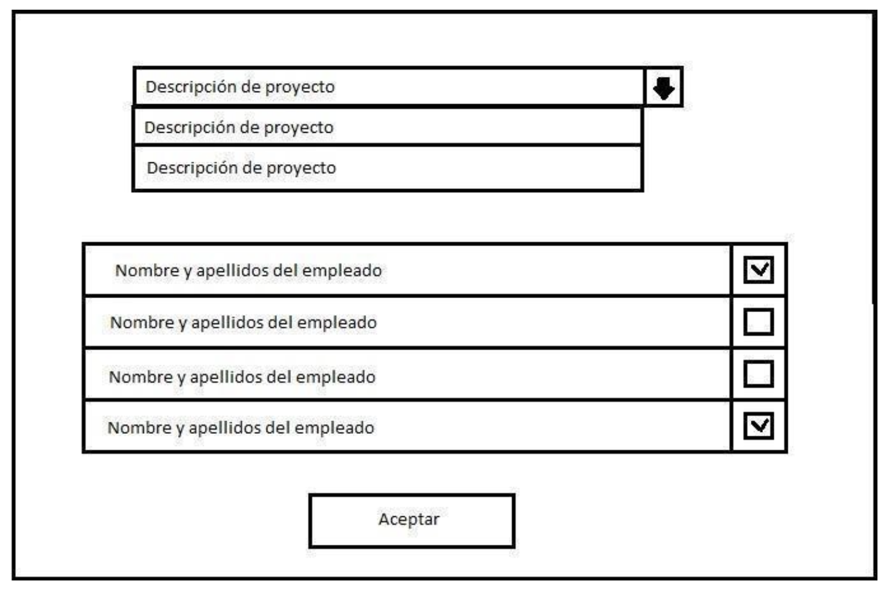

# Intern Training Program - Final Practice

## Contents

1. [Description](#1-description)  
2. [Preliminary Considerations](#2-preliminary-considerations)  
3. [Exercise Submission](#3-exercise-submission)  
4. [Evaluation](#4-evaluation)  
5. [Exercises](#5-exercises)  
   - [5.1 Employee Management](#51-employee-management)  
     - [5.1.1 Employee Query](#511-employee-query)  
     - [5.1.2 Add New Employee](#512-add-new-employee)  
     - [5.1.3 Employee Termination](#513-employee-termination)  
   - [5.2 Project Management](#52-project-management)  
     - [5.2.1 Project Query](#521-project-query)  
     - [5.2.2 Add New Project](#522-add-new-project)  
     - [5.3 Project Termination](#53-project-termination)  
     - [5.4 Assign Employees to Projects](#54-assign-employees-to-projects)  
   - [5.5 Data Analysis](#55-data-analysis)  

---

## Exercise Submission

The final project must include the following deliverables:

- Backend source code project (Java)  
- Frontend source code project (Vue)  
- Python project  
- PowerPoint presentation using the provided template  

---

## Evaluation

The project will be evaluated based on the following criteria:

- Proper backend functionality (30%) including validations and error handling  
- Proper frontend functionality (30%) including validations and error handling  
- Indicator generation and graphical representation (30%)  
- Final presentation (10%)  

Extra points can be earned by completing the following tasks:

- Integrating Python-generated charts into the application's graphical interface  
- Adding improvements to any part of the application (search, sorting, pagination, visuals, additional stats...)  
- Dockerizing any of the involved services (backend, frontend...)

TODO:
- Review frontend form validation

---

## 5. Exercises

### 5.2 Project Management

### 5.4 Assign Employees to Projects

The query form includes an **Assign Employees** button.

When clicked:

- A window opens to assign employees to projects  
- Dropdown shows descriptions of all active projects  
- Multi-record block lists all active employees  

When a project is selected:

- All employees appear  
- Those already assigned to the selected project have a checkbox marked  
  (indicates a record in `PR_EMPLEADOS_PROYECTO` table)

- Unchecking removes the record  
- Checking inserts a record with assignment date (`F_ALTA`)  
- Selecting another project refreshes the employee list and checkbox states accordingly

---

### 5.5 Data Analysis

Read the Employee and Project tables into two Pandas DataFrames.

Generate graphical representations of the following indicators:

#### Employees

- Top 5 longest-tenured employees  
- Top 5 most recently hired employees  
- Distribution of employee tenure in the company  
- Yearly trend of new hires  
- Yearly trend of terminations (can be combined with hires)  
- Top 2 years of highest employee growth/decline  
- Distribution of single vs married employees  
- Age distribution of employees  
- Mean and standard deviation of employee age  

#### Projects

- Number of active, completed, and total projects  
- Histogram of project durations  
- Distribution of projects by location  

#### Projects and Employees

- Distribution of number of projects assigned per active employee  
  Example:  
  - 1 project: 54 employees  
  - 2 projects: 12 employees  
  - 3 projects: 2 employees  

- Top 5 projects with the most assigned employees  
- List of projects with no assigned employees (anomaly detection)
