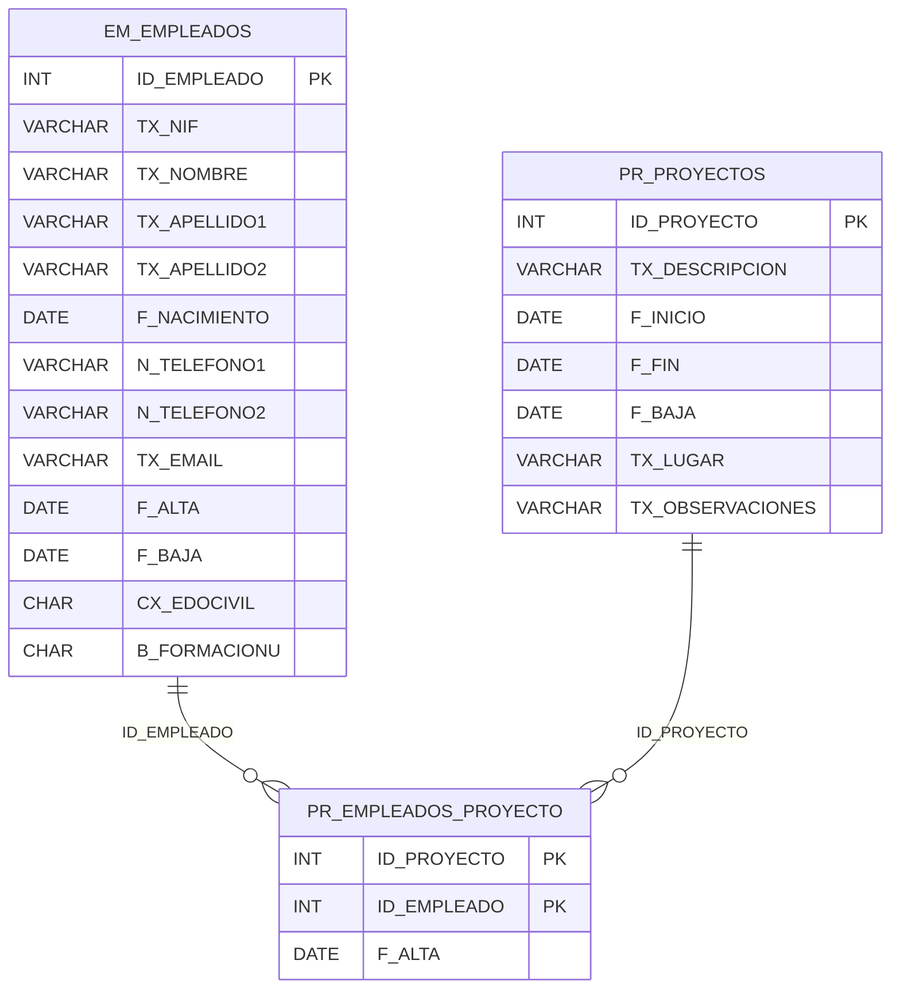

# Backend - Project Management App

This is the Java Spring Boot backend for the Project Management application.  
It provides all necessary RESTful API endpoints for managing employees, projects, and their assignments.

---

## 📦 Technologies

- Java 17
- Spring Boot 3
- Spring Data JPA
- Hibernate
- MySQL

---

## 🗃️ Database Schema

The schema includes three tables:

- `EM_EMPLEADOS`: Employees
- `PR_PROYECTOS`: Projects
- `PR_EMPLEADOS_PROYECTO`: Assignment table (many-to-many between employees and projects)




---

## 📡 API Endpoints

### 👥 Employee Endpoints

| Method | Endpoint                  | Description                       |
|--------|---------------------------|-----------------------------------|
| GET    | `/employees`              | List all active employees         |
| POST   | `/employees`              | Add a new employee                |
| POST   | `/employees/bulk`         | Add a list of employees           |
| PUT    | `/employees/{id}/terminate` | Terminate an employee by ID     |

---

### 🧱 Project Endpoints

| Method | Endpoint                   | Description                      |
|--------|----------------------------|----------------------------------|
| GET    | `/projects`                | List all active projects         |
| POST   | `/projects`                | Add a new project                |
| PUT    | `/projects/{id}/terminate` | Terminate a project by ID        |

---

### 🔗 Assignment Endpoints

| Method | Endpoint                                                | Description                            |
|--------|---------------------------------------------------------|----------------------------------------|
| GET    | `/assignments/project/{projectId}`                      | Get employees assigned to a project    |
| GET    | `/assignments/employee/{employeeId}`                    | Get projects assigned to an employee   |
| POST   | `/assignments/{projectId}/assign/{employeeId}`          | Assign an employee to a project        |
| DELETE | `/assignments/{projectId}/unassign/{employeeId}`        | Unassign an employee from a project    |

---

## ⚠️ Error Handling

Handled via a global exception handler. Returns meaningful `400`, `404`, and `409` errors, including:

- `EmployeeNotFoundException`
- `ProjectNotFoundException`
- `EmployeeAlreadyTerminatedException`
- `ProjectAlreadyTerminatedException`
- `EmployeeAssignedException`
- `ProjectAssignedException`
- Validation errors (field-specific)

---

## 🔍 Notes

- The database must be created using the provided SQL script.
- Table creation is handled manually; Hibernate does not auto-generate schema.
- IDs are auto-incremented via MySQL (`AUTO_INCREMENT`).

---

## 🚀 Run the Backend

```bash
mvn spring-boot:run
```

Make sure MySQL is running and the schema `PRACTICA` exists.

---

## ✅ Example JSON Payload (Add Employee)

```json
{
  "nif": "12345678Z",
  "firstName": "Luis",
  "lastName1": "Gomez",
  "lastName2": "Sanchez",
  "birthDate": "1990-06-15",
  "phone1": "600123456",
  "phone2": "600654321",
  "email": "luis@example.com",
  "startDate": "2024-01-01",
  "civilStatus": "S",
  "universityEducation": "S"
}
```

---

## 🧪 Running Tests

```bash
mvn test
```

Unit tests use JUnit and Mockito. Some tests mock repository data to ensure isolation.

---
