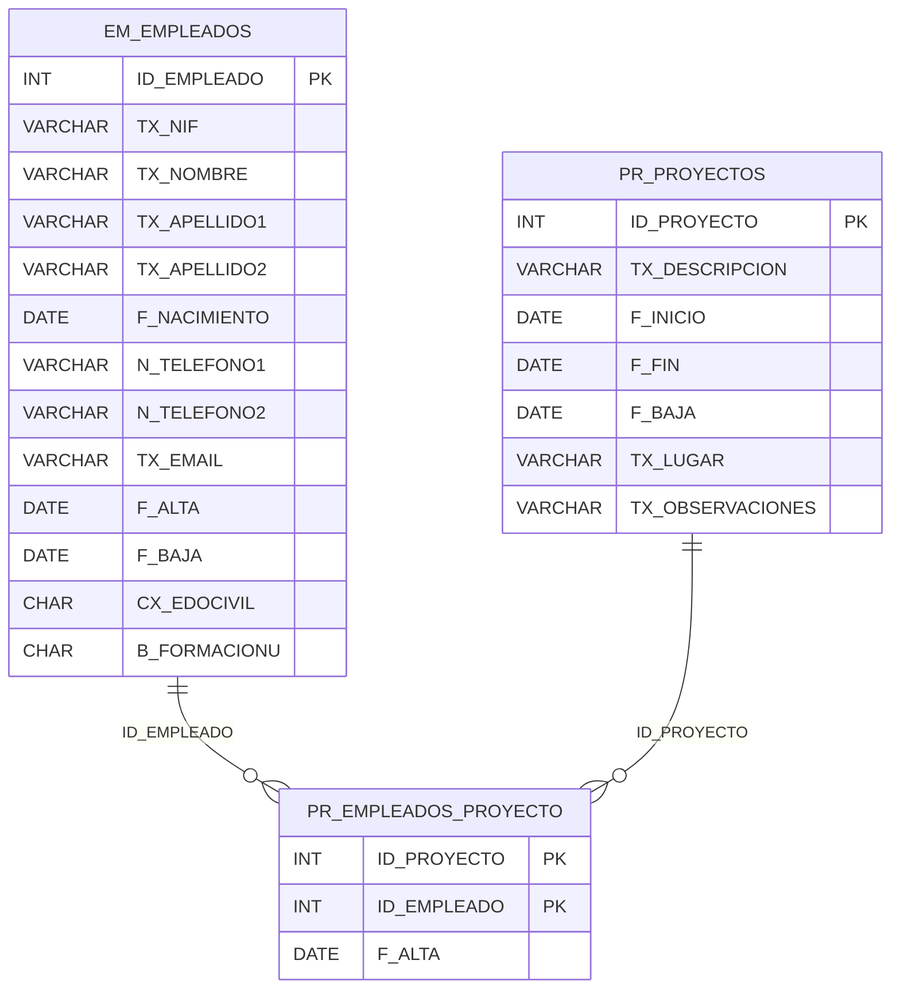

# Database

This directory contains the SQL script used to create and initialize the **MySQL** database for the Project Management Application.

## Contents

- `mysql_DDL_PRACTICA.sql`: SQL script to create the schema, tables, and relationships used by the backend.

## Database Schema

The schema is defined under the `PRACTICA` schema and includes:

- `EM_EMPLEADOS`: Employee records.
- `PR_PROYECTOS`: Project records.
- `PR_EMPLEADOS_PROYECTO`: Join table representing a many-to-many relationship between employees and projects. It also includes an assignment date (`F_ALTA`).

Primary and foreign keys are explicitly defined.

### Relationships

- An employee can be assigned to **many projects**, and a project can have **many employees**.
- The assignment table enforces referential integrity with foreign keys pointing to the employee and project tables.

### Diagram

